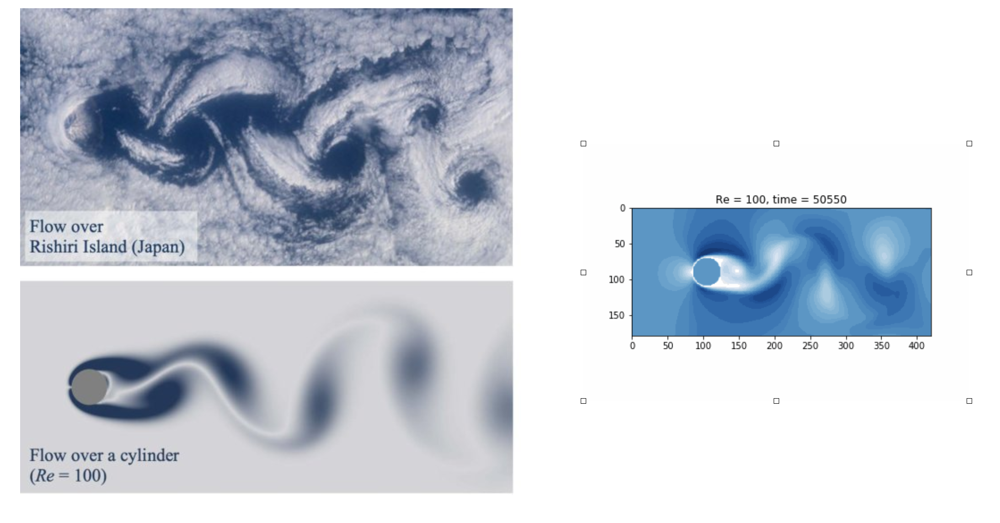
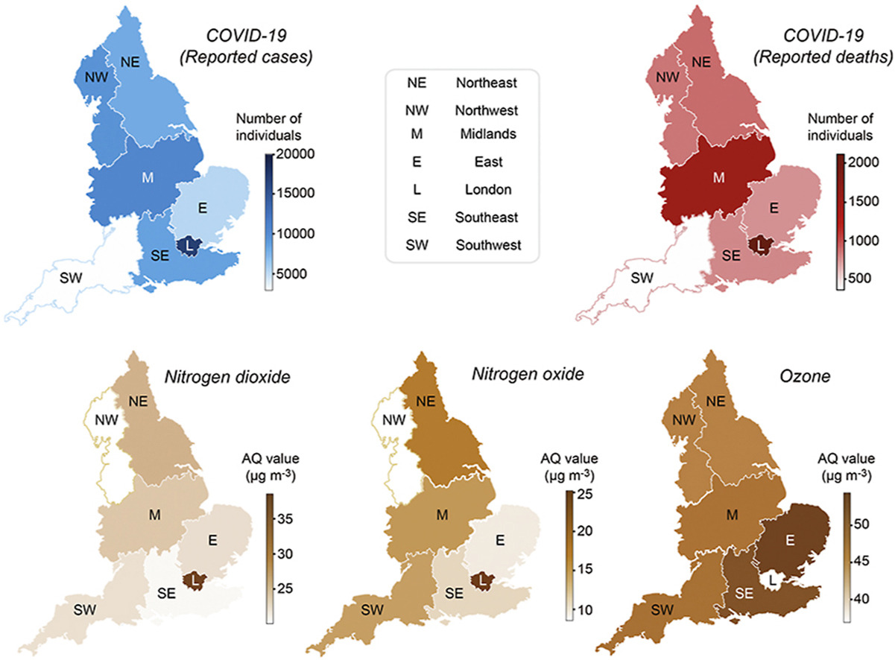

&nbsp;



This includes some of the coursework completed during my Atmospheric Physics PhD candidacy at Toronto (2021).

See [this repo](https://github.com/apurba-biswas/undergrad) for my masters thesis, some computational physics report and other small courseworks.

## Fluid Dynamics : Lattice Boltzmann Method

[YouTube](https://youtu.be/hsLlideYlqE) (~26 mins presentation)

This was a short final project as part of my graduate fluid dynamics course PHY1530.  An exploratory and introductory project. It was an informal presentation for fellow graduate students (~9 others). I was intrigued by the picture on the left, and wondered how one could simulate flow over a cylinder. I came across the Lattice Boltzmann method, and looked at some of the theoretical foundations.

## Climate Change Modelling : Air pollution and COVID-19 mortality

This was part of a final project. This was again, to be presented to fellow graduate students with the intent of receiving feedback on the studies we were using to inform the final, which was writing a memo from these findings. The figure below is from one of the studies.

[YouTube](https://youtu.be/X359IefOnUU) (~ 8 mins presentation)

