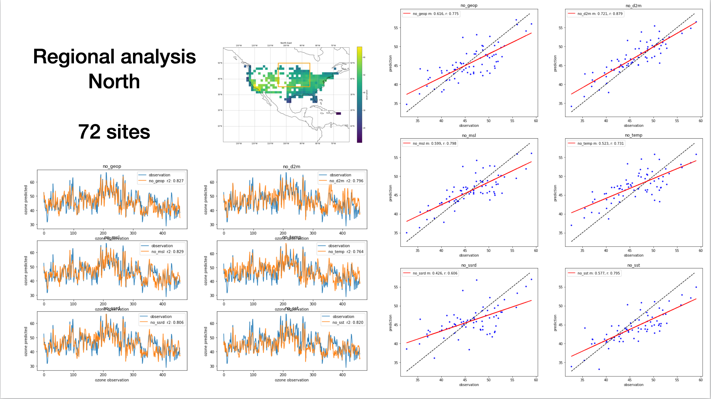

This project was undertaken Summer 2021. I was being guided by Professor Dylan Jones and senior PhD student Tai-Long He, both at the University of Toronto. I was working remotely with the 5 hour time difference (due to COVID). Fortunately, I was  able to attend the weekly group meetings on Thursdays 7pm with a cup of tea. I learnt about the group members' research, falling broadly under Atmospheric Modelling and Composition. As for my own research, a lot of the foundational work was completed by Tai-long He, which I've heavily drawn from (see figures below). The statistical analysis was guided by Professor Jones. It is with their help I've been able to complete this work. 

### Research

Following Tai-long [1], I further investigated the deep learning model used to predict summertime ozone concentrations over the US. We were interested in what gave the model it's temporal skill, and why it was able to capture the dynamics well. One way of approaching this problem was through explicitly looking at feature importance, by excluding certain meteorological features and then conducting a regional analysis. We hoped to gain some insight of what dynamics the model was learning. My analysis shows after feature exclusion, there were some differences in predictive skill and that these mainly dependent on region. The results were in agreement with Tai-long's findings, and emphasized the importance of including NOx emission sectors. There were many questions left after this analysis.

At the beginning of summer, I spent time reproducing most of the results in the archival paper (including appendices) by independently conducting my own model runs and analysis. With little previous experience, this gave me an opportunity to learn Deep Learning in Tensorflow and climate analysis with Xarray.  By  the end, I gave a semi-formal 40-minute presentation to the group. [You can find the slides here](https://github.com/apurba-biswas/apurba-biswas.github.io/blob/master/files/group_presentation.pdf)

An even more informal explanation lies below, which I hope is accessible, succinct and somewhat complete. Feel free to send me comments/questions/feedback on the work below.

## Why is ozone important?

Tropospheric (ground-level/near-surface) ozone, is a major air pollutant and a greenhouse gas. As an air pollutant, ozone risks those who are already have a compromised respiratory systems (e.g. asthma) and children. It's oxidative capability also impacts crop yield. As a greenhouse gas, it is much more **potent than CO2**.

### Why is this a tricky problem?

Ozone is not directly emitted by most anthropogenic activity. Instead, it's produced in the atmosphere by a chemical reaction, composed of NOx (nitrous oxides), VOCs (volatile organic compounds) and UV radiation. Due to the photochemical reaction, ozone concentrations are high during summertime. This reaction, however is complicated and non-linear. 

A recent example demonstrating this complexity would be the concentration during the COVID-19 pandemic. Upon lockdown in several countries (China, India, US, UK), NOx emissions from transport (and indirectly other sectors) were reduced. However, this would not immediately be obvious in the ozone concentrations.

_Atmospheric models used to simulate the distribution of ozone typically do not reproduce the observed long-term trend in tropospheric ozone. Furthermore, these models tend to overestimate summertime surface ozone abundances in the United States._ [1]

## The model, data and previous results

Being inspired by Shi et al's precipitation nowcasting [3], Tai-long devised a Recurrent U-Net model, to capture spatial and temporal variation in ozone concentrations over the US. The hybrid model consists of stacked CNNs and LSTMs, to learn spatial correlations and dynamics respectively. Use of skip-connections preserves higher-level features of the model.

He utilized 6 daily meteorological fields (drivers of ozone chemistry and tropospheric conditions) from the ERA-5 Interim Reanalysis, and monthly mean NOx emissions from CEDS (community emissions data system). These were gridded at a spatial resolution of $1.5^o \times 1.5^o$.

For initial model development and my study, we worked with the 1980-2014 dataset, with the first 30 summers used for training, and the rest for testing and model evaluation. Tai-long used to model to evaluate other inventories. 

The figures below are from paper submitted to Geophysical Research Letters [2]

Figure 2. Observed (top left) and predicted (top right) mean JJA MDA8 ozone during 2010– 2014. Also shown (bottom left) is the absolute error (in ppb) for the predicted minus observed MDA8 ozone. The errors are calculated where the AQS observations are located. Correlation (r2) between the observed and predicted MDA8 ozone in each grid box is shown in bottom right. Also shown in bottom right are the definitions of the CONUS, Northeastern US, Southeastern US and the West coast domains in blacked dashed box, black solid box, blue box, and green box, respectively.

Figure 3. Observed (blue line) and predicted (orange line) daily (first column), 7-day averaged (second column), and monthly averaged (third column) JJA MDA8 ozone (in ppb) during the testing period (2010–2014). Shown are the time series for the CONUS (first row) ...

(see paper for full figure)

The model is able to capture both short and long-term variability.
_The model is able to capture 85%, 86%, and 76% of the variability of MDA8 in the northeastern, southeastern, and western United States, respectively_ [1]

_The large negative bias on the West Coast (see Table 1) and in the central United States (Fig. 2) could be due to the absence of emissions of NOx from soils in the predictors, which have been shown to be a major source of NOx in these regions_

I find this regional skill interesting as there is more variability MDA8 ozone in the East than the west as by the AQS observation. I've plotted the mean and standard deviation of the MDA8 ozone (ppb) below.

The question of "What the model is learning?" is a tricky one, prevalent in deep learning. We've tackled it in this specific context. This is partly addressed by looking at the activation maps learned by the convolutional layers of the model's encoder [1], though apart from telling us overall regional importance, it's hard to further analyse. I layout potential solutions to this problem later under "Future work".

## Meteorological feature exclusion and regional analysis

What we initially wanted to explore is what gave the model it's temporal skill. We were hoping to discover any insights of potential physical phenomena learned by the model (on potentially subseasonal timescales). The deep-learning answer would be to interpret the stacked LSTM cells. However, at the time of searching, I wasn't able to find an accessible way to do this. The complexity of the model made this an even more daunting task. Therefore, we decided on a more simpler approach, where we would remove a meteorological predictor at a time, and look at the model performance, in different regions. 

One of the experiments ran by Tai-long was to train the model with just the meteorological features. The model was able to capture the variability with similar correlation scores as above. However, the model was positively biased overestimating ozone concentrations. This demonstrated the importance of including NOx emissions.

Hence, to study what features were important to capture the variability, it would be sufficient to just use the met. fields. However, when conducting a regional analysis and studying potential biases, it would be tricky to diagnose model performance. Therefore, when continuing ahead, I decided to use all but one predictor, excluding just one of the meteorological field at a time.

After training the models in these configurations, we test their predictive skill over 2010-2014. For reference, the 6 meteorological features excluded and their respective model names were
1. geopotential at 500 hPz (Z) -> no_geop
2. 2 meter dew point -> no_d2m
3. mean sea level pressure -> no_mslp
4. 2 meter temperature -> no_t2m
5. downward shortwave radiation -> no_ssrd
6. sea surface temperature -> no_sst

Collectively, I refer to these as featureless models.

## Results

The figure above shows the performance of the model over the 2010-2014 test period.

1) The left panel shows the predicted ozone time-series for the different models. Observation (truth) in blue and predicted in orange. The pearsons correlation co-effecient r is calculated (**mislabled as r2**)
2) The right panel is a scatter of the mean observation against the mean predicted ozone. Dashed line is the one-to-one line. The fit of the "all_features" model is in blue, with the fit of the featureless model is in red.

Focusing on the time-series plot, it is clear that removal of a feature degrades predictive skill, with some variance across the models (r2 from 0.6 ~ 0.66). Feature importance is not immediately clear, with some featureless models with a slight positive/negative bias.

The scatter on the right shows that removal of a meteorological feature also biases the model, with a negative bias in the high-ozone regime and vice versa. However, as we're working with MDA8, there's not much low ozone to study. With the scatter plot, we were trying to determine how each model would perform in low/high ozone regime. Clusters in the scatter would sign towards anomalous behavior. Though, all models perform similarly and feature importance is not clear with little variance (r2 from 0.81 ~ 0.87).

### Regional Analysis and feature importance

Another way of looking at the dynamical impacts of removing a feature was to conduct a regional analysis, as there would be different systems at play in different region. This more direct sensitivity analysis is parallel to the looking at the activation maps from the convolutional layers of the model, another way of looking at regional/local feature importance.

The baseline model is the all features model, which we compare against the featureless (without the met. field) models. We're trying to see where these models differ.

**Difference in all_features and featureless**

The difference of the two models (all_features - featureless) is plotted below. The mean and median difference are calculated.

From these, we can tell that overall over CONUS, the models do not vary significantly, but with some grids being poorly predicted. The only models that differ by more than 1ppb are the featureless models without geopotential (geop) and sea surface temperature (sst).

One of the few features that is consistent across all the models is the positive bias in the intermountain west. One factor is the lack of observations in this region, and hence further reduced skill. Furthermore, background ozone concentrations are influenced by ozone produced by lightning in the upper atmosphere, and carried down by stratospheric intrusions.[4]

On the Gulf Coast, all models except the featureless geopotential model, show a negative bias, with the d2m model showing significant bias. It is possible the seabreeze effect is being captured by the all_features model, and removal of a relevant predictor reduces the degree to where the phenomena is captured. 

**The difference in correlation**

Here, a pair-wise difference in correlation to the observation.

1. correlation of all_features model and the observation
2. correlation of the featureless model and observation

Then, we've plotted 1-2. Hence, negative blue values mean that the featureless model performs better than the all features model.

The result is surprising, as I would've expected the opposite. The plots may seem saturated with blue, especially in the intermountain west. I believe again this is due to the lack on information in that region. However, the magnitude of these differences are insignificant. Given the better temporal skill of the all_features model over CONUS, this grid view hints to the generalization of the model.

The regions are red are also of interest, as they are where the all_features model perform better, hence, removing a feature decreases predictive skill in these regions.  The featureless d2m model and temperature model show a large region in the East/North East respectively where this is the case.

However, due to the magnitude of this effect, feature importance is once again not clear.

## Zooming into different regions

Similar to Tai-long's analysis, we zoomed into different regions over CONUS, and looked at the predicted time-series and also the observation vs prediction scatter, similar to the initial analysis.

5 different regions were analyzed, with  some overlap. This procedure is flexible, and the lat-lon bounding boxes can be easily defined. The regions were similar to the analysis in Tailong's paper. 3/5 regions are presented below (please look at the slides for North East and the West Coast). The number of grid boxes with observations are also displayed.

When writing about the analysis below, I've used
1) to talk about the time series plot
2) to talk about the scatter plot

to avoid repetition.

For the scatter plot, I've included
- the one-to-one observation line in dashed black
- the blue dots are the individual predictions
- the red line is the fit of the predicted ozone (linear regression with m being the gradient, r being pearsons correlation co-efficient)

&nbsp;

**Note: on the time-series, I've mislabeled the r score as r2**

1. There's some variability in the predictive skill of the models, with featureless d2m having the worst skill, and featureless sst in next place. I think this points to the seabreeze effect as mentioned earlier.
2. Overall, mean ozone is captured well amongst the models with little variability. There's a clear positive bias in the featureless d2m model. Featureless sst has the weakest fit.

We chose to study this region due to the lack of observations in the data.

1. Weak temporal predictive skill
2. Scatter in the models

1. Though part of this region overlaps with the intermountain west (only a few locations in the upper left corner of the bounding box), we still have good temporal skill in this region, with little spread across the models. 

2. This region was interesting because there are noticeable differences in the scatter plot, unlike the other regions studied. For example, the featureless d2m model captures mean ozone well, as opposed to the featureless ssrd model. This region hints more strongly at feature importance than the other regions. 

### How to interpret this?

From Tailong's analysis, we already knew that the skill of the all_features model was region dependent. I think my analysis above hints to the degree its regional. 

From the 6 predictors, I would expect 2m temperature (t2m), 2m dew point (d2m) and downward shortwave radiation (ssrd) to have local effects and hence impact predictive skill regionally. Also, I expected the same with the other predictors (geopotential height, sea-surface temperature and mean sea level pressure), to a lesser degree because of where they are defined, and the different dynamics at play in different regions.

However, this doesn't seem to be the case, and the skill of the featureless model varies regionally, irrespective of the regional dynamics. The only region in our study which would go against this is the North region, where there was noticeable difference in the mean-ozone scatter, but not much spread in the temporal skill of the models.

**Why?**

A couple of thoughts

- Maybe this is to be expected, as excluding 1 out of 13 features is not going to effect the model so much
- NOx sector features are "more" locally dominant - would expect more change in regional skill if these were to be excluded. Unclear how this would impact temporal predictive skill, but would expect a clear bias in the scatter
  
Both these points elude to the "robustness" of the model architecture. The deeper encoder layers, after max pooling, are less sensitive to these local (regional) features.

## Feature and activation maps

In Tai-long's analysis, he calculated the average activation maps for the training data (see Appendix D in paper [1] ). Interestingly, there is little activation over the intermountain west region.

 *For D2M and T2M, the largest features are mainly located over the southwest and the Gulf Coast. Remarkably, even if SST is only defined over the ocean, the convolutional operation has a smearing effect and the model can still capture the continental teleconnections between MDA8 and SST. All meteorological predictors show sensitivity around Hawaii and in the Atlantic...* [1]

 My analysis further supports this importance of D2M and T2M in in the southwest and Gulf Coast region. From my analysis, it is difficult to comment on the teleconnections.

_Unlike meteorological predictors, the activations of NOx emissions are very local, which is likely due to the short lifetime of NOx near the surface. Fig. 11 shows the ChAM for the NOx emission sectors. The NOx emissions related to agriculture and waste handling are mainly affecting ozone predictability in the southern US, although on average they have less activation in the deep learning model compared to other sectors. Overall, ENE, IND and TRA are the most important contributors to ozone predictability._[1]

Looking at the scale of figures 10 and 11, it would seem apparent that ENE, IND and TRA NOx sectors are the most important contributors to ozone predictability. Spatially, this maybe evidently true. However, it is hard to comment on the effect of their inclusion on temporal predictability.

### Feature visualization

Tai-long had visualized the feature maps for the encoding convolutional layers of the all_features model (see figure below or Appendix D in [1]). _Feature maps from the first convolutional layer are of particular interest as they represent the sensitivity of the predicted JJA MDA8 ozone, and can be distinguished between each input predictors. The features can be utilized to analyze the discriminative sensitivity of the deep learning model to each ozone predictor._ 

A simple experiment I ran was looking at how this would change when trained with only one of the the meteorological predictors. Hence, I trained a model with T2M only with the NOx sectors, and visualized the features. The plots look very similar. The effect of the meteorological predictor is unclear in this average activation map. I think this points to the again the "robustness" of the model and these spatial features - the features learnt from the model over the training period seem static. Importance is attributed to the localized NOx features. 

# Future work

Below, are ideas on how to carry on the research. This work is intended to for the original all_features model.

Initially, if there was obviously weather conditions where the model did not perform well, we could see what climatological conditions are behind this. For example in the low/high ozone regimes. Upon brief inspection, there did not seem to be any such repeating behavior. Hence, the study should head towards sub-seasonal timescales, where we have distinct periods of anomalous behavior.

## Looking at activation maps of different climate analogues

One of the ways of interpreting what the model is learning is through activation maps. Above, we looked at the average activation map using all the training data. These activation maps are dependent on the input. Hence, we need 'interpretable' inputs.

The idea of interpretable inputs is more developed for single-item classification tasks (imagine identifying cat or dog). What these tasks have are single instances where you can scrutinize model performance. The same is difficult to do in time-series prediction.  We must also have a prior hypothesis / an expected outcome from the model, as opposed to the "truth" (observation) value that we wish for the model to learn.

I think another way of approaching this is to look at the activation maps under different weather conditions. We could split the training data into climate analogues (e.g. high temperature and high solar radiation) for any number of the 6 meteorological features.

Another way would be to generate fictions input data where we have expected outcome. We could impose certain conditions on the model and look at the activation maps. Given favorable conditions, is the model _really_ effected by the sea-breeze effect or stratospheric intrusions?

## Shapely values and local explanations

**One of the major flaws in doing feature exclusion is that the model does not account for interactions in-between the features.**

If we simplify deep-learning to non-linear regression, then when comparing our featureless-models, one could argue that they're entirely different models. Though in this ozone prediction context, where we're able to analyze different regions over the US, I think feature exclusion is still a useful method.

A recent trend in Interpretable Machine Learning has seen the rise of Shapely values, a concept from economic game theory. It's a way of quantifying feature importance, treating features as members in a coalition, and using weighted combinatorics to assign their contribution to the model's prediction i.e. the coalition's output.

For Pythonistas, the SHAP system emerges as a way of uniting efforts of different interpretable methods. Though development has mostly been for machine learning methods, applications to deep learning models (DeepLIFT) are slowly coming to fruition. For deep learning, approximate shapely values are computed.

The shapley values explain a feature's contribution to the model's output, explaining individual or "local" instances. In our context, local directly translates to specific grid boxes. Hence, we can use the aggregate statistics from these regional shapely values as a measure of feature importance.

Given the current model (encoder-LSTM-decoder with skip connections), it's currently tricky to leverage DeepLIFT or the SHAP ecosystem to efficiently calculate shapely values. However, a simpler and smaller Conv-LSTM model could be used for experimentation within the SHAP ecosystem. Or we could implement our own shapely value algorithm.

I did a rough experiment (poorly fit and didn't spend much time tuning)  an XGBoost model for regression, using only the meteorological predictors over the US, to get a rough view of feature importance. The preliminary results were promising, showing that D2M, T2M and SST were the most important features. Though this requires further exploration.

## References
   
1. see Tailong's repo DLO3 (forked on my GitHub) for paper and model
2. Tai-Long He, Dylan B. A. Jones, Binxuan Huang, Yuyang Liu, Kazuyuki Miyazaki, Zhe Jiang, E. Charlie White, Helen M. Worden, John R. Worden : Deep learning to evaluate US NOx emissions using surface ozone predictions (under review)
3. X. Shi, Z. Chen, H. Wang, D.-Y. Yeung, W.-k. Wong, and W.-c. WOO. Convolutional lstm network: A machine learning approach for precipitation nowcasting. In Advances in Neural Information Processing Systems 28. 2015.
4. Zhang, L., Jacob, D. J., Yue, X., Downey, N. V., Wood, D. A., and Blewitt, D.: Sources contributing to background surface ozone in the US Intermountain West, Atmos. Chem. Phys., 14, 5295–5309, https://doi.org/10.5194/acp-14-5295-2014, 2014.
