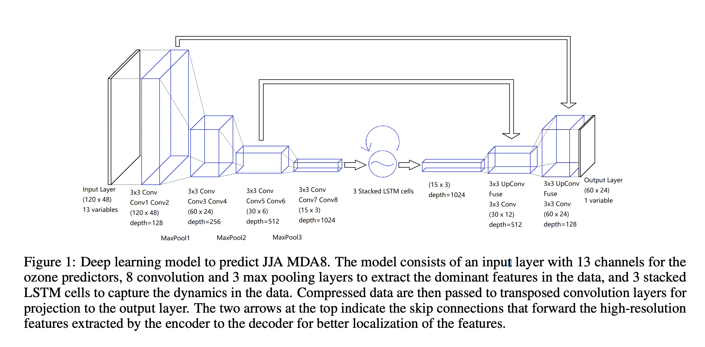

This project was undertaken Summer 2021. I was being guided by Professor Dylan Jones and senior PhD student Tai-Long He, both at the University of Toronto. I was sitting in London (not the one in Ontario), and was working remotely with the 5 hour time difference (COVID restrictions). Fortunately, I was still able to attend the weekly group meetings on Thursdays 7pm with a cup of tea. I learnt about the group members' research, all falling broadly under Atmospheric Modelling and Composition.

### Research

Following the work of Tai-long [1], I further investigated the deep learning model used to predict summertime ozone concentration over the US. We were interested in what gave the model it's temporal skill, and why it was able to capture the dynamics well. One way of approaching this problem was through was through explicitly looking at feature importance, by excluding certain meteorological features and then conducting a regional analysis.

At the beginning of summer, I spent time reproducing all the results in the archival paper by independently conducting my own model runs and analysis. By  the end, I gave a semi-formal 40-minute presentation to the group. [You can find the slides here](../../files/group_presentation.pdf)

An even more informal blog-style explanation lies below, which I hope is more accessible and succinct than the paper. A lot of the foundational work was done by Tailong, and I've heavily drawn from his work. The analysis was guided by Professor Jones. 

## Why is ozone important?

Tropospheric (ground-level/near-surface) ozone, is a major air pollutant and a greenhouse gas. As an air pollutant, ozone risks those who are already have a compromised respiratory systems (e.g. asthma)and children. It's oxidative capability also impacts crop yield. As a greenhouse gas, it is much more **potent than CO2**.

### Why is this a tricky problem?

Ozone is not directly emitted by most anthropogenic activity. Instead, it's produced in the atmosphere by a chemical reaction, composed of NOx (nitrous oxides), VOCs (volatile organic compounds) and UV radiation. Due to the photochemical reaction, ozone concentrations are high during summertime. This reaction, however is complicated and non-linear. 

A recent example demonstrating this complexity would be the concentration during the COVID-19 pandemic. Upon lockdown in several countries (China, India, US, UK), NOx emissions from transport (and indirectly other sectors) were reduced. However, this would not immediately be obvious in the ozone concentrations.

_Atmospheric models used to simulate the distribution of ozone typically do not reproduce the observed long-term trend in tropospheric ozone. Furthermore, these models tend to overestimate summertime surface ozone abundances in the United States._ [1]

### Data

### The model

Being inspired by Shi et al, [2] Tai-long devised a Recurrent U-Net model, to capture spatial and temporal variation in ozone concentrations over the US. The hybrid model consists of stacked CNNs and LSTMs, to learn spatial correlations and dynamics respectively. Use of skip-connections preserves higher-level features of the model.

### Regional analysis

My results

### Future work

SHAP

## References

[1] - see Tailong repo DLO3 with arXiv paper (forked)

[2] - cite precipitation now-casting paper

[3] - Ozone during the COVID era
